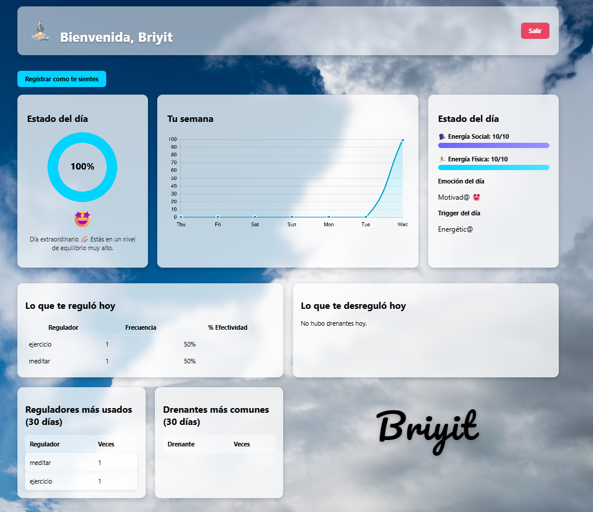
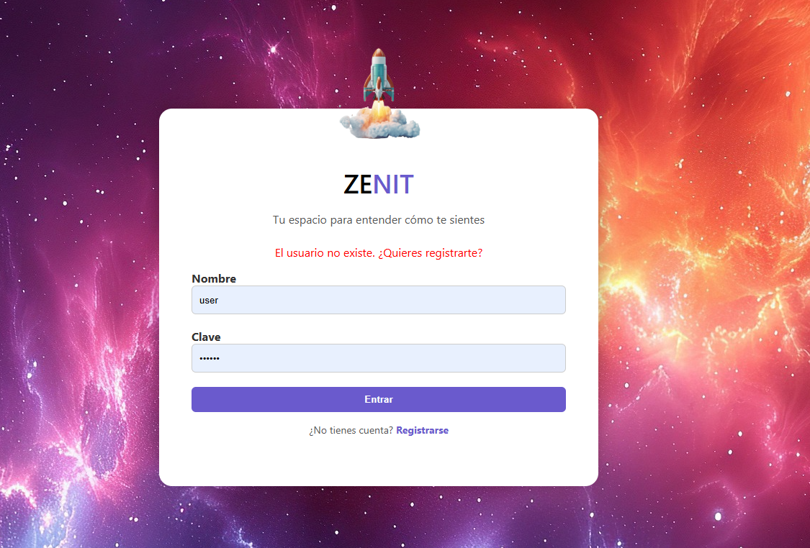
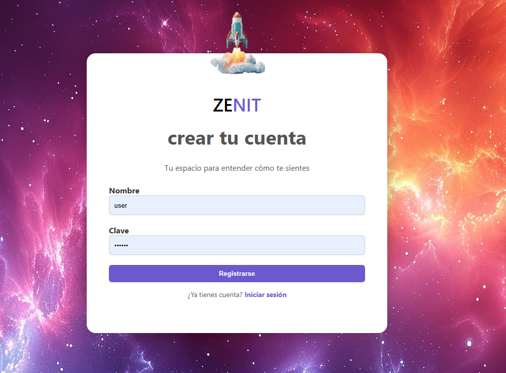
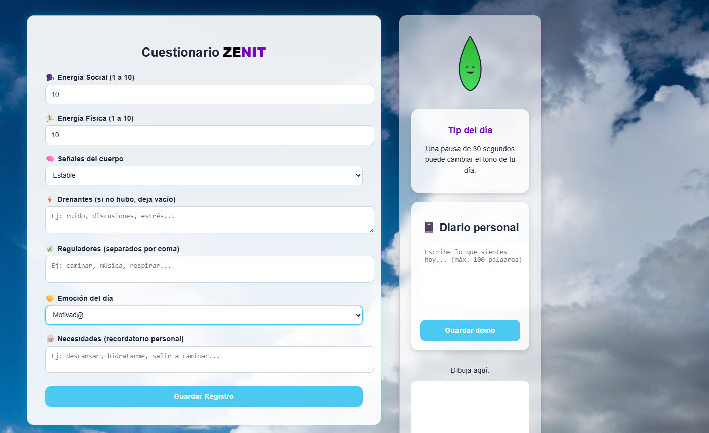
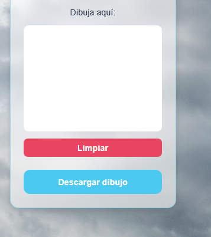
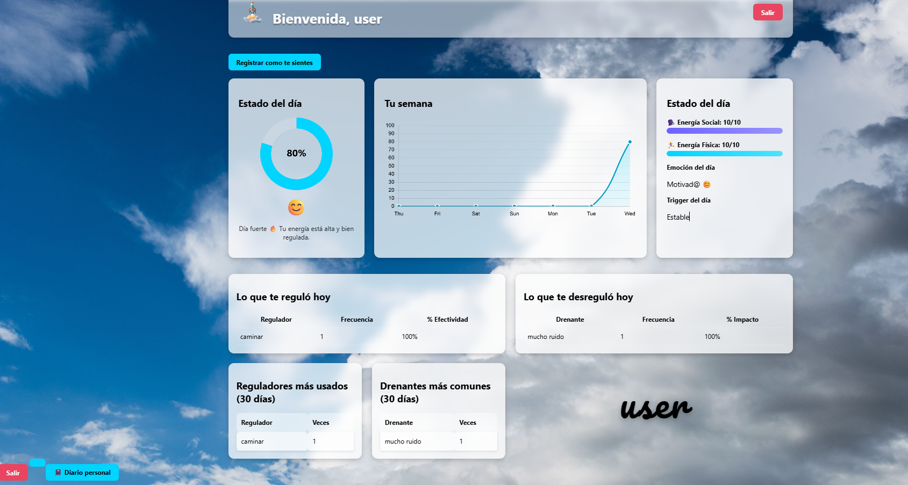
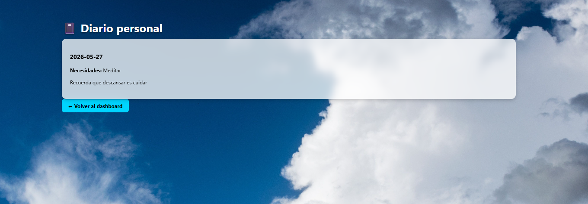

# 🌌 ZENIT – Plataforma de Autogestión Emocional
Autora: Briyit

ZENIT es una aplicación web diseñada para acompañar a las personas en su proceso de autoconocimiento emocional.
Permite registrar el estado del día, visualizar tendencias, identificar reguladores y drenantes, y escribir un diario personal que ayuda a comprender mejor el propio bienestar.

----



----

El proyecto combina un diseño minimalista, visualizaciones dinámicas y un flujo seguro basado en sesiones reales.

## Arquitectura del proyecto
- Backend: FastAPI
- Frontend: Jinja2 + HTML + CSS
- Base de datos: SQLite
- Sesiones: Cookies firmadas (seguras, sin exponer datos del usuario)
- Gráficos: Chart.js
- Animaciones: SVG + JavaScript
- Estado emocional: cálculo propio + visualización con “gota emocional”

  
- [Arquitectura Zenit](docs/arquitectura.md)

---
📁 Estructura del proyecto
```text
/zenit
│
├── main.py
├── README.md
├── requiremets.txt
│
├── /templates
│     ├── login.html
│     ├── dashboard.html
│     ├── cuestionario.html
│     ├── diario_historial.html
│     └── resultado.html
│
├── /static
│     ├── dashboard.css
│     ├── cuestionario.css
│     ├── dashboard.js
│     ├── gota.js
│     ├── diario.js
│     └── img/
│
└── /docs
      ├── tecnico.md
      └── arquitectura.md
```

## Características principales
- Cuestionario diario con energía social, energía física, señales corporales, emoción y necesidades.
- Gota emocional interactiva que refleja el estado del usuario en tiempo real.
- Dashboard dinámico con:
  - Gauge del día
  - Gráfico semanal
  - Reguladores y drenantes
  - Estadísticas de los últimos 30 días
  - Diario personal con guardado independiente mediante botón dedicado.
- Historial de días con notas y necesidades.
- Sesiones reales .
- Interfaz limpia y ligera, optimizada para uso diario.

## Instalación
Clonar el repositorio:

```bash
git clone https://github.com/Briy1t/zenit.git
cd zenit
```
Crear entorno virtual:

```bash
python -m venv venv
source venv/bin/activate   # Linux/Mac
venv\Scripts\activate      # Windows
```

Instalar dependencias:

```bash
pip install -r requirements.txt
```

 Ejecución

```bash
uvicorn main:app --reload
```


## Endpoints principales

|Ruta	|Método	|Descripción|
|-----|-------|-------|
|/ |	GET |	Login |
|/dashboard	|GET	|Vista principal del usuario|
|/cuestionario	|GET/POST |	Registro del estado diario|
|/guardar_diario	|POST|	Guardado independiente del diario|
|/diario	|GET	|Historial del diario|
|/logout	|GET	|Cierre de sesión|


##  Capturas de pantalla

- 
- 
- 
- 
- 
- 
   

## Roadmap
- Exportar diario a PDF
- Gráficos mensuales y anuales
- Notificaciones de recordatorio
- Integración con móvil
- API pública para datos personales
- Hashing de contraseñas (bcrypt)
- Autenticación avanzada con JWT
- Lanzarla en AWS

------------------
👩‍💻 **Autora**
Briyit
Desarrolladora del proyecto ZENIT


📄 Licencia
Este proyecto es de uso personal y educativo.
No se permite su redistribución comercial sin autorización de la autora.
